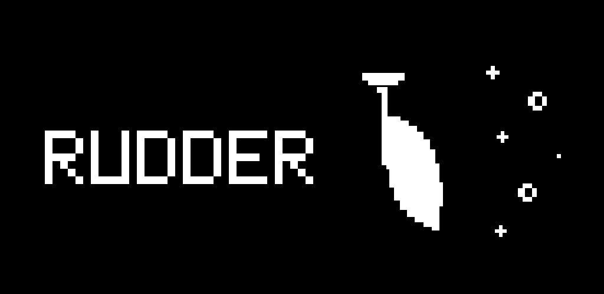

<div align="center">
  
</div>

# Rudder 🫧

<div align="center">
  <p>
    <a href="https://discord.gg/tmjdmhp4xD"></a>
    <a href="https://www.npmjs.com/package/@ruddercode/rudder-core"></a>
    <a href="./LICENSE"></a>
  </p>
</div>

**Rudder records the prompts you give your AI coding assistants and learns
durable rules from your corrections.**

The goal of rudder is to give the person doing the work a truthful record
of their own AI-assisted coding process so they can understand their decisions,
improve their workflow, and build better software.

It installs lightweight hooks into **Claude Code** and **Codex** that log every
prompt to a local SQLite database, learn durable rules from your corrections,
and add the relevant saved rules to future prompts.

## Quickstart

```bash
npm install -g @ruddercode/rudder-core    # puts `rudder` on your PATH
rudder init                       # create the database and install the hooks
```

Then just use Claude Code and/or Codex as you normally would — every prompt is
logged automatically. Run the daemon to compile corrections as you work:

```bash
rudder start      # compile queued evidence and open the learned-rules dashboard
rudder rules      # compile pending corrections and list active learned rules
```

Requires Node.js ≥ 23.6 and at least one of `claude` / `codex` on your `PATH`.
See [Install](#install) and [Commands](#commands) for the full details.

## Why

Rudder starts from a simple problem: When I code with AI, I feel like I haven't
done anything except watch my agent code for me.

The final diff tells only part of the story. It does not show how I got there,
where I changed direction, what I trusted, or what I rewrote.

Today's agents write code for you. Rudder exists to make them write code with you.

## How it works

```
┌──────────────┐  UserPromptSubmit/Stop hooks  ┌─────────────────────┐
│ Claude/Codex │ ◀──────────────────────────▶ │ ~/.rudder/rudder.db │
└──────────────┘  applicable rules + verdicts  └──────────┬──────────┘
                                                          │ out-of-band CLI call
                                                          ▼
                                                     rule writing
```

- **Local only.** Everything lives in `~/.rudder/rudder.db`. Rule generation
  uses the LLM CLI you already use. Your data stays yours.
- **Non-intrusive.** The hooks are fail-safe — if rudder ever errors, it logs to
  stderr and exits `0` so it never blocks or breaks Claude Code or Codex.
- **Rule injection & enforcement.** Rudder reads the bounded tail of the local session
  transcript, runs an applicability sub-agent at prompt submit to inject only
  relevant rules into agent context, and runs a verifier sub-agent at Stop to
  retry when enforced rules were violated. The out-of-band writer resolves durable
  preferences and repeated pitfalls as versioned atomic rules.

## Requirements

- **Node.js ≥ 23.6**
- **Claude Code** (`claude`) and/or **Codex** (`codex`) on your `PATH`. You only
  need one of them; rudder records whichever is installed and uses whichever is
  available to run the learned-rule sub-agents.

## Install

```bash
npm install -g @ruddercode/rudder-core    # puts `rudder` on your PATH
rudder init                       # creates the database and installs the hooks
```

`rudder init`:
1. Creates `~/.rudder/rudder.db`.
2. Adds `UserPromptSubmit` and `Stop` hooks to `~/.claude/settings.json`.
3. Adds `UserPromptSubmit` and `Stop` hooks to `~/.codex/hooks.json`.

Existing config files are backed up to `*.rudder-bak` before being modified, and
the command is idempotent — running it twice won't duplicate the hooks.

Codex requires one-time trust approval for new command hooks. Review and approve
the Rudder entry when Codex prompts on the next interactive session (or inspect
it through `/hooks`); Codex silently skips the hook until it is trusted.

### From source

```bash
git clone https://github.com/Vivekyy/Rudder.git rudder && cd rudder
npm install        # install dependencies
npm run build      # compile to dist/ (npm link's `rudder` bin points here)
npm link           # puts `rudder` on your PATH
rudder init
```

> If you don't want to `npm link`, you can run rudder directly with
> `node /path/to/rudder/bin/rudder.ts <command>`. `rudder init` always wires the
> hooks to an absolute path, so they keep working regardless of your `PATH`.

## Upgrade

```bash
npm update -g @ruddercode/rudder-core    # or: npm install -g @ruddercode/rudder-core@latest
```

The hooks point at the global install's absolute path, which is stable across
upgrades, so there's nothing to re-wire. Re-run `rudder init` only after an
upgrade whose notes say the hook format changed (it's idempotent and safe to
re-run). If you installed from source, upgrade with `git pull && npm install`
instead — the `npm link` symlink picks up the new code with no rebuild.

## Commands

| Command | Description |
| --- | --- |
| `rudder init` | Create the database and install the Claude Code + Codex hooks. |
| `rudder start [options]` | Run rule compilation and open the learned-rules dashboard. |
| `rudder rules [options]` | Compile pending corrections and list active learned rules. |

### `rudder start`

Starts a small local server (on `127.0.0.1`, port `41789` — override with
`RUDDER_PORT`). While it runs, each new prompt queues an event. Your
`claude`/`codex` CLI processes those events out of band, and the dashboard
updates live with active learned rules and the pending prompt count.

The dashboard is a **standalone app** (a PWA):

- The **first** time, `rudder start` opens a small installer page — click **Install
  app** (or, in Safari, `File → Add to Dock`) to add rudder to your dock with its
  own icon and no browser chrome. The installed window auto-sizes to its content.
- **After** it's installed, `rudder start` launches the app directly (no browser
  tab). The app loads from the running daemon, so keep `rudder start` running.

If you'd rather not install anything, open `http://127.0.0.1:41789/` in a browser.

It's safe to leave running and safe to run twice (a second `rudder start` just
re-opens the window). If the daemon isn't running, TRACE events stay queued and
are compiled the next time you run `rudder start` or `rudder rules`.

### `rudder rules`

Compiles queued prompt/session evidence into atomic rules, then lists the active
rules. Compilation runs three fresh local `claude` or `codex` child sessions:
the applicability sub-agent selects relevant active rules, the verifier checks
whether prior behavior enforced them, and the writer emits `NEW`, `NOOP`, or
`UPDATE` lifecycle decisions. Updates retain older versions in SQLite for audit.

| Option | Default | Description |
| --- | --- | --- |
| `--agent claude\|codex` | `claude`, else `codex` | Which LLM runs the sub-agents. |
| `--no-compile` | off | List stored rules without running the compiler. |

When `rudder start` is running, compilation happens automatically after the
capture debounce. Prompt-time retrieval is local and deterministic: no model
call is made before Claude Code or Codex receives the prompt.

## Data & privacy

All prompts are stored in plaintext in `~/.rudder/rudder.db` (schema: timestamp,
local day, source, session id, working directory, project, prompt text, model,
and the raw hook payload). Companion tables hold queued rule evidence, runtime
applicability/verifier outputs, versioned learned rules, and rule provenance.
Rule sub-agents use the same local `claude`/`codex` CLI — nothing is sent
anywhere else. To wipe everything, delete `~/.rudder/`. To stop recording,
remove the hook from `~/.claude/settings.json` and `~/.codex/hooks.json`.

Set `RUDDER_HOME` to override the storage location (used by the test suite). The
hooks honor `RUDDER_DISABLE` — rudder sets it on internal agent calls, so
sub-agent prompts are never recorded.

## Uninstall

1. Remove the Rudder `UserPromptSubmit` and `Stop` entries from `~/.claude/settings.json`.
2. Remove the Rudder `UserPromptSubmit` and `Stop` entries from `~/.codex/hooks.json`.
3. `rm -rf ~/.rudder`.

## Development

```bash
npm install
npm run typecheck    # tsc --noEmit
npm test             # node --test
npm run build        # compile to dist/ (the only code published to npm)
```

Source lives in `src/` and the CLI entry point is `bin/rudder.ts`. In development
these `.ts` files run directly via Node's native type stripping; `npm run build`
compiles them to `dist/`, which is what gets published and what the installed
`rudder` bin runs.
