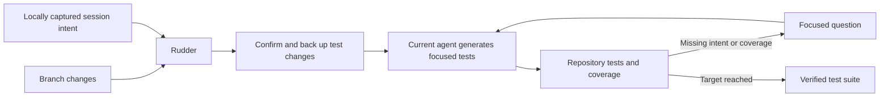

<div align="center">
  
</div>

# Rudder 🫧

<div align="center">
  <p><strong>Turn coding-session intent into verified unit tests.</strong></p>
  <p>
    <a href="https://github.com/RudderCode/Rudder/stargazers"></a>
    <a href="https://www.npmjs.com/package/@ruddercode/rudder-plugin"></a>
    <a href="https://www.npmjs.com/package/@ruddercode/rudder-plugin"></a>
    <a href="https://discord.gg/tmjdmhp4xD"></a>
    <a href="./LICENSE"></a>
  </p>
</div>

Rudder is a local plugin for Claude Code and Codex that generates tests from
two things your coding agent already has: the changes on your branch and the
intent expressed in your coding session.

A diff shows what changed.
Your prompts explain why it changed and which edge cases and outcomes matter.
Rudder combines both sources in a fresh-slate test workflow. 

Rudder uses the repository's own test and coverage tools, and test generation 
stays with the coding agent and model you already use.

## Quick start

### Requirements

- Node.js 23.6 or newer
- npm and Git on `PATH`
- A current Claude Code or Codex installation with plugin support

### Claude Code

Add the Rudder marketplace:

```text
/plugin marketplace add RudderCode/Rudder
```

Install the plugin:

```text
/plugin install rudder@rudder
```

Restart the session before running Rudder.

### Codex

Add the Rudder marketplace:

```text
codex plugin marketplace add RudderCode/Rudder
```

Install the plugin:

```text
codex plugin add rudder@rudder
```

Start a new Codex session and review the bundled prompt hook when Codex asks
you to trust it.

### Run Rudder

Build your feature in a Git branch as usual, then ask your agent:

> Run Rudder

You can also provide it an explicit coverage target:

> Use $rudder to verify this branch at 90% coverage.

Rudder inspects the branch and session before proposing a test reset.
Review the exact paths if tests have already changed.
Approve the backup and reset only when those paths are correct.

## How it works



When you run Rudder, it:

1. Resolves the target branch and merge base.
2. Reads the prompts associated with the current repository and branch.
3. Directs your current coding agent to generate focused unit tests based
   on the intent inferred from your prompts.
7. Runs the narrowest relevant tests, followed by the applicable test and
   coverage commands.
8. Asks concrete questions to fill in the gaps between your intent and the
   generated code.

Rudder never uses `git reset --hard` or a broad `git clean`.
It does not clear your tests without explicit confirmation, and it always
backs up a copy of your original unit test suite.

## What counts as intent

Rudder requires your prompts or answers to express each test expectation.
Existing test changes are not automatically accepted as product intent.

Rudder should infer answers from the code, tests, repository, or conversation.
When a real ambiguity remains, it asks for a concrete test decision.
For example:

> On timeout, should `loadProfile` return cached data or surface the error?

Your answer becomes part of the current session and informs the next test pass.

## Local data and privacy

The prompt hook links submitted prompts to the active repository and branch.
Records are stored in a local SQLite database:

```text
~/.rudder/rudder.db
```

Set `RUDDER_HOME` to use a different state directory.
Set `RUDDER_DISABLE_PROMPT_CAPTURE=1` to disable future capture.

The current plugin does not transmit captured prompts to RudderCode.
Your coding agent may process that context when you invoke Rudder.
Its provider terms and configuration still apply.

You can also ask the installed skill to:

- show the local storage path, capture status, and prompt count;
- disable or enable future prompt capture; or
- delete all stored prompt records after explicit confirmation.

Disabling capture does not delete existing records.
See the [privacy notice](./docs/privacy.md) for the complete data-handling description.

## Design principles

| Principle | What it means |
| --- | --- |
| Intent-driven | Prompts and answers define expected behavior; the diff defines what needs tests. |
| Bring your own agent | Your current coding agent performs the reasoning and generation with its existing model access. |
| Repository-native | Rudder discovers and runs the project's own test framework, commands, and coverage tooling. |
| Fresh but recoverable | Approved test changes are backed up before Rudder starts from a clean test slate. |
| Production-safe | The workflow is limited to tests and does not change production code, coverage configuration, or repository thresholds. |
| Local context | Captured prompt records stay in a user-scoped SQLite database on your machine. |

## Development

Clone the repository, install dependencies, and run the validation suite:

```bash
npm ci
npm run format:markdown:check
npm run typecheck
npm test
npm run build
```

`npm test` uses Node's built-in test runner and rebuilds the bundled prompt hook
before running the suite.

To load the repository directly in Claude Code during development:

```bash
claude --plugin-dir .
```

See the [installation guide](./docs/install.md) for local Codex setup and the
published-package workflow.

## Documentation

- [Installation](./docs/install.md)
- [Privacy](./docs/privacy.md)
- [Support](./docs/support.md)
- [Terms of use](./docs/terms.md)

## License

Rudder is licensed under the [Apache License 2.0](./LICENSE).
