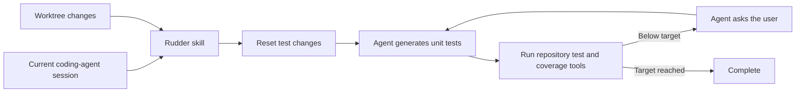

  

# Rudder 🫧

  
<strong>Turn the intent in a coding-agent session into a verified unit-test suite.</strong>

  

    
    
    
  

## The idea

A coding session contains more intent than a code diff. The user's prompts often
explain the behavior they wanted, the edge cases they cared about, and the
tradeoffs that never made it into comments or commit messages. Rudder uses that
local session context to create tests for the new production code in the current
worktree.

Rudder starts from a fresh test slate, runs the generated tests, measures
coverage, and asks focused questions until the configured coverage target is
reached.

## Proposed experience

Rudder runs inside the coding-agent session where the feature was built. Before
publishing a pull request, the user invokes the installed Rudder skill with a
coverage target:

> Run the Rudder test workflow for this worktree until coverage reaches 90%.

The exact invocation can vary between coding agents; the workflow remains the
same. Rudder then:

1. Resolves the merge base and identifies the production code introduced in the
   worktree.
2. Uses the user's prompts from the current coding session to understand the
   behavior that code is meant to implement.
3. Generates a set of focused unit tests based on intent encoded by the user's
   prompts.
4. If coverage is below the target, asks concrete questions to the user in the
   current session to clarify intent, then uses this intent to continue writing
   unit tests until the coverage target is hit.

A useful question is narrow and changes a test expectation:

> When the upstream request times out, should `loadProfile` return cached data
> or surface the timeout to its caller?

Rudder should not ask the user for information it can infer from the repository,
the implementation, existing test conventions, or the coding session. Each
question should resolve an ambiguity and add new behavioral intent to the
current session.

## A fresh test slate

Rudder generates unit tests for production code introduced in the worktree. To
make sure those tests are derived from the user's intent rather than an earlier
test-writing attempt, Rudder reverts all testing code already added or changed in
the worktree before generation begins.

This reset includes committed, staged, unstaged, and untracked test changes
relative to the merge base. Before clearing anything, Rudder writes a
recoverable snapshot of the affected test paths, including the contents of
untracked files that Git cannot restore from a base revision. The current agent
identifies test paths from the repository's own structure and conventions
instead of relying on a particular language or test framework.

Because deleting an untracked file can remove the only copy, Rudder asks the
user to confirm the inferred path set before clearing untracked tests or any path
whose classification is ambiguous. If a path is not confirmed as test code, it is
left in place and surfaced to the user rather than deleted.

Changes to existing tests are highly important for monitoring shifts in intent.
They show where an established behavior may be changing, not just where more
coverage is needed. Before resetting the test slate, Rudder compares each change
with the current session's prompts:

- If a user's prompts directly encode the intent to change a test, that change
  becomes a requirement for the regenerated suite.
- If the prompts do not encode that intent, Rudder flags the test change to the
  user in the current session before continuing.

After the reset, the current agent owns the worktree's unit-test changes for the
duration of the workflow. Production code remains unchanged.

## Local and BYOK

The local version of Rudder does not choose a model or make a separate model API
call. The user's current coding agent generates the tests using the model and
credentials the user has already configured—a bring-your-own-key approach.

Rudder is delivered to that agent as a skill. The skill defines how to gather
intent from the current conversation, inspect the worktree, evaluate existing
test changes, clear the test slate, generate unit tests, run the repository's
native tooling, measure coverage, and ask the next question. Local helper tools
handle deterministic worktree and session-data operations; the user's agent
handles reasoning and generation.

This keeps generation and every follow-up question inside the coding session
that produced the implementation.

## How the system fits together

Rudder is a skill-guided workflow backed by local context and worktree tools.

| Component | Responsibility |
| --- | --- |
| Agent skill | Give the current coding agent the complete pre-PR test-generation workflow and its rules. |
| Session context | Supply the user's prompts and answers from the current coding session. |
| Worktree tools | Resolve the base, identify introduced production code, classify test changes, and reset the test slate. |
| Intent monitor | Detect changes to existing tests, ground them in directly expressed prompt intent, or flag them to the user. |
| User's coding agent | Generate and revise unit tests using the user's existing model access. |
| Repository tools | Run the project's own unit-test and coverage commands regardless of language or test framework. |
| Coverage loop | Turn uncovered worktree code into focused questions and continue generation until the target is reached. |

The existing SQLite prompt store provides normalized local session data. The
skill and its helper tools use that store to connect the current agent session
with the active worktree.

## MVP acceptance criteria

The first useful version is language- and test-framework-agnostic. It can:

- install a Rudder skill into a supported coding agent;
- associate the current agent session's prompts with the active worktree;
- identify the production code introduced relative to a target branch;
- treat a change to an existing test as intentional only when the user's prompts
  directly encode that intent, and otherwise flag it in the current session;
- revert all testing code introduced or changed in the worktree;
- direct the user's current coding agent to generate focused unit tests without
  changing production code;
- discover and run the repository's own unit-test and coverage tooling;
- measure coverage of the production code introduced in the worktree;
- ask concrete questions in the current coding session whenever coverage is
  below the configured minimum;
- incorporate each answer into the next test-generation pass; and
- continue until the coverage target is reached before PR publication.

## Delivery plan

### 1. Define the skill contract

Write the agent-agnostic instructions for the entire workflow: resolve the base,
read current-session intent, review test changes, reset testing code, generate
unit tests, run repository tooling, measure coverage, and ask the user for
missing intent.

### 2. Build deterministic local tools

Implement session lookup, base resolution, and diff classification for production
and test code. Cover committed, staged, unstaged, and untracked changes,
including modifications to tests that already exist on the base branch.

### 3. Monitor changes in test intent

Compare changes to existing tests with the current session's prompts. Preserve a
test change as a requirement only when a user prompt directly expresses that
intent; otherwise, instruct the agent to flag it before resetting the test slate.

### 4. Generate through the user's agent

Have the skill clear worktree test changes, direct the current agent to generate
the suite, and run the repository's native test and coverage tooling. Keep the
workflow independent of any particular language, test framework, model, or
provider.

### 5. Close the coverage loop

Use uncovered production code and accumulated session intent to formulate a
focused question. Keep the answer, the next generation pass, and the coverage
check inside the same coding-agent session, repeating until the target is
reached.

## Product decisions

- **BYOK generation:** the user's current coding agent performs generation with
  the user's existing model credentials; Rudder does not call a model directly.
- **Skill-driven workflow:** the product ships as agent instructions plus local
  deterministic tools rather than a generator tied to one provider.
- **Repository agnostic:** the skill discovers and uses the repository's own
  language, test framework, commands, and coverage tooling.
- **Current-session UX:** every prompt, generated test, coverage result, question,
  and answer stays in the coding session where the feature was implemented.
- **Direct intent standard:** a change to an existing test is justified only when
  the user's prompts directly express the intent to change it.
