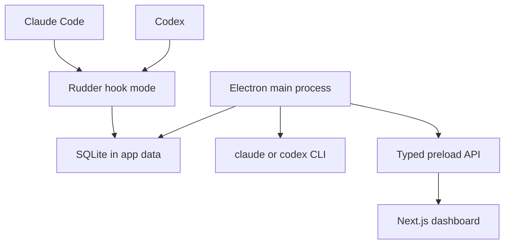

# Rudder

**Rudder is a local-first desktop app for understanding how you work with AI coding assistants.**

It records the prompts you send to Claude Code and Codex, stores them in a local
SQLite database, classifies the day's work, and turns that activity into live
stats and a readable daily digest.

## Status

Rudder is a downloadable React/Electron app. The desktop app owns the full
product flow:

- Claude Code and Codex hooks capture prompts locally.
- SQLite state lives in the Electron app data directory.
- The dashboard is a Next.js React renderer running inside Electron.
- Agent lookup uses the desktop bridge only; there is no hosted web fallback.

## How It Works



Everything sensitive stays local. Prompt capture, SQLite, classification, and
digest generation happen on the user's machine. Classification and digest prose
use the `claude` or `codex` CLI already installed on that machine.

## Development

Requires Node.js >= 23.6.

```bash
npm install
npm run typecheck
npm test
npm run build
```

Useful app commands:

```bash
npm run dev:renderer   # Next.js dev server
npm run dev:electron   # Electron app pointed at the dev renderer
npm run package        # Build desktop packages with electron-builder
```

`npm run build` compiles the Electron/main process code into `dist/` and exports
the Next.js renderer into `out/`.

## App Setup

The desktop app exposes setup actions for:

- Installing or repairing the Claude Code `UserPromptSubmit` hook.
- Installing or repairing the Codex `notify` program.
- Showing hook status, agent availability, and the active database path.

Packaged hooks invoke the Rudder executable in `--rudder-hook claude` or
`--rudder-hook codex` mode, so prompt capture does not require a global `rudder`
binary or a separate Node installation.

## Data And Privacy

Prompt rows are stored in plaintext in the local SQLite database with timestamp,
local day, source, session id, working directory, project, prompt text, model,
and raw hook payload. Prompt tags are stored beside them in `prompt_tags`.

Rudder does not upload prompt data. Live stats and digests run through the local
desktop app.
